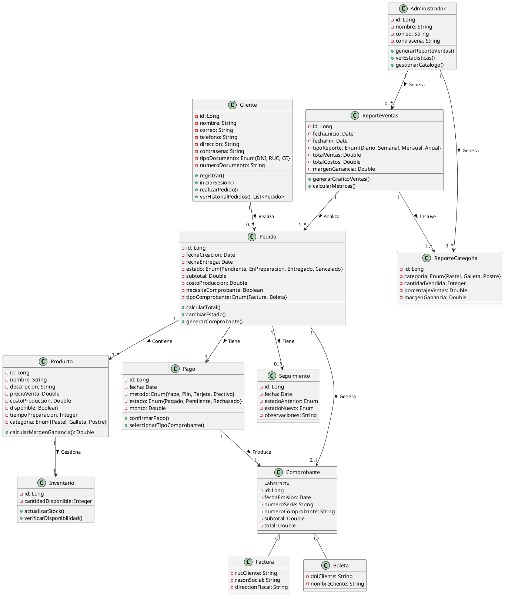

# Diagrama de Clases - Sistema "Como en Casa"

Este diagrama de clases modela el sistema propuesto para digitalizar y automatizar la gestión del negocio "Como en Casa", permitiendo un mejor control de pedidos, pagos, clientes, productos y reportes.

## Diagrama UML

